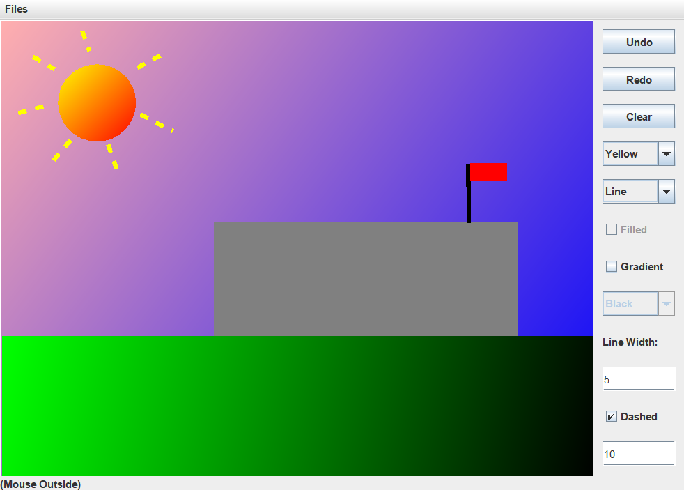

# JavaPaint

A Painting/Drawing Program written in Java.

# Features 
- Uses personally written data structures from ADT to handle shapes drawn.
- Uses personally written 2D shapes from ADT that users may choose to draw.
- Ability to undo and redo.
- Ability to clear panel.
- Ability to choose shapes dynamically for drawing.
- Ability to choose drawing properties such as colors, filled, gradient colors, and line width dynamically.
- A statusbar with the current mouse position.

# To Be Implemented
- The constructors for the shape classes are too long. Shorter alternatives will be added.

# Known Bugs
- TextFields allows non-integer inputs.